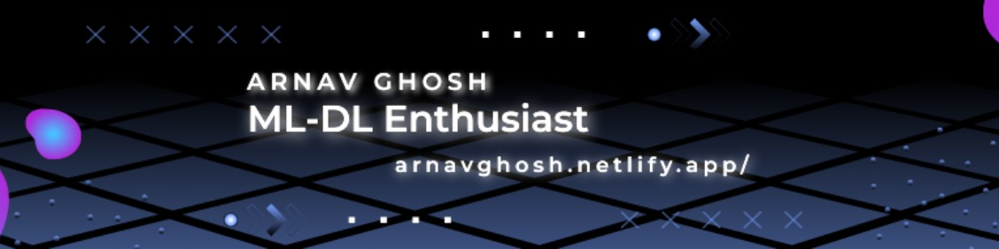

<h1 align="center">Hi 👋,I'm Arnav Ghosh and here's a glimpse about me</h1>
<h2 align="center">I'm a passionate learner with an unquenchable thirst for knowledge.</h2>                   

- My curiosity drives me to explore a diverse range of subjects, always eager to uncover new insights and deepen my understanding. 📚✨

- 🌱 I’m currently learning **Quantum Machine Learning and Horizontal Machine Learning** 

- 💬 Ask me about **Machine Learning, Artificial Intelligence, Deep Learning, NLP, Quantum Machine Learning** 

- 📫 How to reach me **arnav032919@gmail.com**

<h3 align="left">Connect with me:</h3>

# 💻 Tech Stack:
                   

### Just to look cool😎

    
  

 
   

### 🔝 Top Contributed Repo

---

